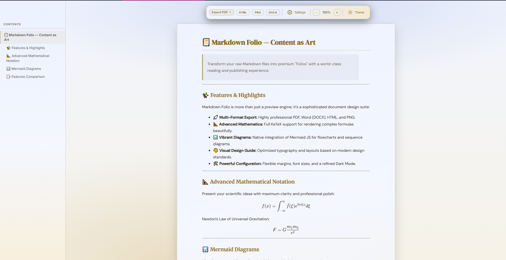
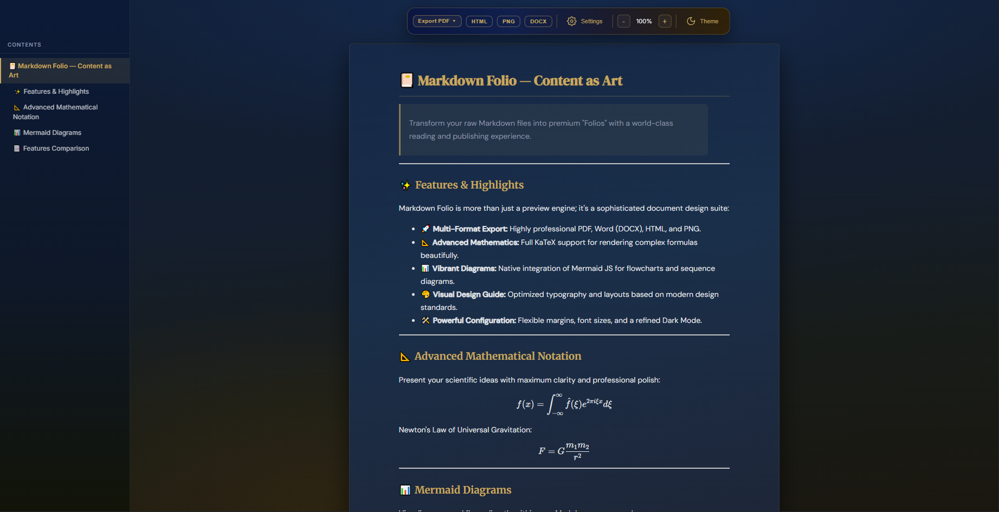

# Markdown Folio

[English](https://github.com/BiViPi/markdown-folio/blob/main/README.md) | Tiếng Việt

> Biến file Markdown thô thành tài liệu hoàn chỉnh, sẵn sàng in ấn — ngay trong VS Code.

---

## Giao diện

**Light Mode**

**Dark Mode**

---

## Tính năng

- **Xuất đa định dạng** — PDF (A4/A3/Letter, dọc/ngang), Word (DOCX), HTML và PNG chỉ với một click
- **Công thức toán** — Hỗ trợ KaTeX đầy đủ cho công thức inline `$...$` và display `$$...$$`, nhúng native vào Word
- **Mermaid Diagrams** — Flowchart, sequence, Gantt, mindmap, gitGraph và nhiều loại khác
- **Typography** — Font DM Serif Display cho tiêu đề, DM Sans cho nội dung, tùy chỉnh font và khoảng cách thoải mái
- **Mục lục** — Tự động tạo từ heading, click để điều hướng
- **Dark & Light Mode** — Toolbar nổi glassmorphic, chuyển đổi bất cứ lúc nào

---

## Bắt đầu nhanh

1. Mở bất kỳ file `.md` nào
2. Click icon **Markdown Folio** trên thanh tiêu đề editor
3. Dùng toolbar nổi để xuất file hoặc điều chỉnh cài đặt

> Xuất PDF và PNG yêu cầu **Chrome hoặc Chromium** được cài sẵn trên máy.

---

## Góp ý & Báo lỗi

Phát hiện lỗi hoặc có đề xuất? [Mở issue trên GitHub](https://github.com/BiViPi/markdown-folio/issues).
